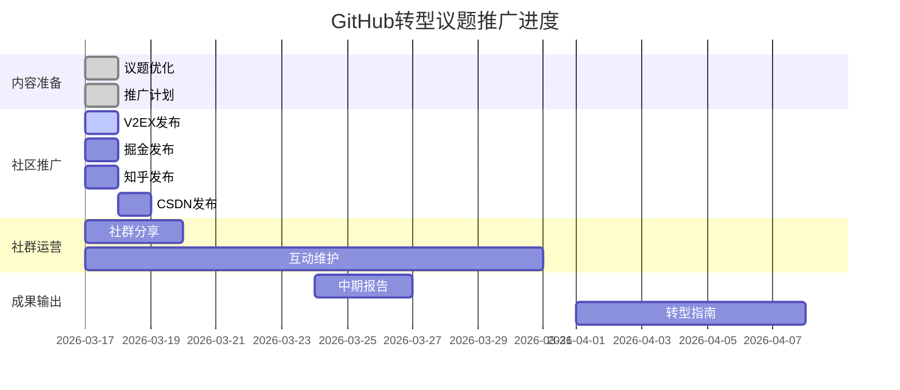

# 📊 转型议题数据追踪

## 议题信息
- **标题**: 🚀 【转型互动】10年Java全栈，AI时代如何破局？
- **地址**: https://github.com/jiangLu-100/jiangLu-100/issues/1
- **创建时间**: 2026-03-16
- **优化时间**: 2026-03-17
- **状态**: 🔥 讨论中

## 📈 核心数据追踪

### GitHub议题数据
| 日期 | 浏览数 | 评论数 | 👍 | ❤️ | 🚀 | 💼 | 🌟 |
|------|--------|--------|-----|-----|-----|-----|-----|
| 03-17 | - | 1 | - | - | - | - | - |
| 03-18 | | | | | | | |
| 03-19 | | | | | | | |
| 03-20 | | | | | | | |
| 03-21 | | | | | | | |
| 03-22 | | | | | | | |
| 03-23 | | | | | | | |
| 03-24 | | | | | | | |

### 参与质量分析
- **深度建议数**: 0
- **案例分享数**: 0  
- **问题讨论数**: 0
- **资源推荐数**: 0

### 社区推广效果
| 平台 | 发布时间 | 浏览数 | 评论数 | 跳转数 |
|------|----------|--------|--------|--------|
| V2EX | | | | |
| 掘金 | | | | |
| 知乎 | | | | |
| CSDN | | | | |
| 社群1 | | | | |
| 社群2 | | | | |
| 社群3 | | | | |

## 🎯 目标进展

### 阶段目标
- [ ] **第一周** (03-17 ~ 03-23): 20人投票，10条评论
- [ ] **第二周** (03-24 ~ 03-30): 50人投票，25条评论  
- [ ] **第三周** (03-31 ~ 04-06): 100人投票，50条评论
- [ ] **最终目标**: 建立转型者社群，输出转型指南

### 当前完成度


## 📝 讨论重点记录

### 有价值的建议（按时间排序）
1. 
2. 
3. 

### 常见问题收集
1. 
2. 
3. 

### 资源推荐汇总
1. 
2. 
3. 

## 🔄 运营策略调整记录

### 03-17 调整
- ✅ 完成议题内容优化，增加互动元素
- ✅ 制定详细推广计划
- ✅ 设置自动提醒cron任务
- ⏳ 开始社区推广

### 03-18 计划
- [ ] 检查第一次推广效果
- [ ] 根据反馈调整回复策略
- [ ] 扩展社群覆盖范围
- [ ] 记录初步数据

## 🤝 参与用户分析

### 用户类型分布
| 类型 | 数量 | 特点 | 互动建议 |
|------|------|------|----------|
| 转型成功者 | 0 | 有实际经验 | 邀请分享详细案例 |
| 转型中 | 0 | 有具体困惑 | 提供针对性建议 |
| 观望者 | 1 | 好奇但未行动 | 降低参与门槛 |
| 建议者 | 0 | 提供建议 | 深度对话挖掘价值 |
| 学习者 | 0 | 寻求资源 | 推荐学习路径 |

### 互动效果分析
- **平均回复时间**: -
- **对话深度**: -
- **用户满意度**: -
- **二次互动率**: -

## 📊 数据更新模板

```markdown
### [日期] 数据更新

**GitHub议题数据**:
- 浏览数: 
- 评论数: (新增: )
- 投票分布: ❤️ | 🚀 | 💼 | 🌟

**今日亮点**:
1. 
2. 

**明日计划**:
1. 
2. 

**运营反思**:
- 做得好的:
- 可改进的:
```

## 🎨 视觉化展示

### 投票分布（示例）
```chart
type: bar
title: 转型路径选择分布
labels: [深度AI, AI增强, 业务结合, 其他]
data: [0, 0, 0, 0]
colors: ['#FF6B6B', '#4ECDC4', '#45B7D1', '#96CEB4']
```

### 参与趋势（示例）
```chart
type: line
title: 日参与度趋势
labels: [03-17, 03-18, 03-19, 03-20]
data: [0, 0, 0, 0]
colors: ['#6C5B7B']
```

## 📋 下一步行动清单

### 今日待办
- [ ] 手动更新GitHub议题内容
- [ ] 在V2EX发布讨论帖
- [ ] 在至少2个社群分享链接
- [ ] 回复现有评论

### 本周重点
- [ ] 每日检查并维护议题互动
- [ ] 完成5个平台推广
- [ ] 收集20+有效投票
- [ ] 建立转型案例库基础

---

**最后更新时间**: 2026-03-17 15:30  
**下次更新**: 2026-03-18 09:00  
**更新方法**: 手动填写或使用自动化脚本

🐑 **羊腰子** - 正在转型的Java开发者  
📈 **目标**: 让这个议题成为Java开发者转型的参考资源